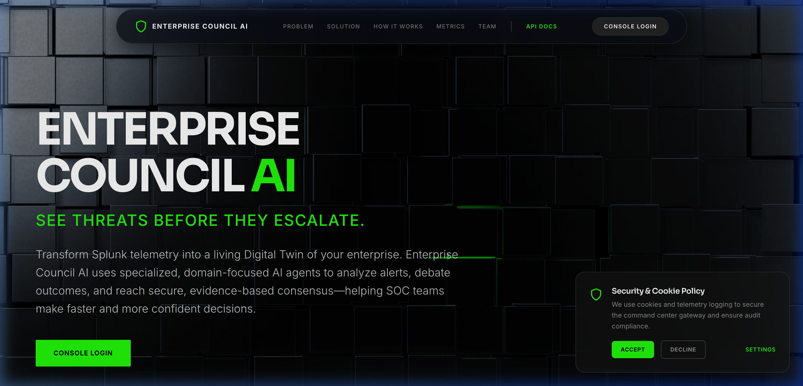
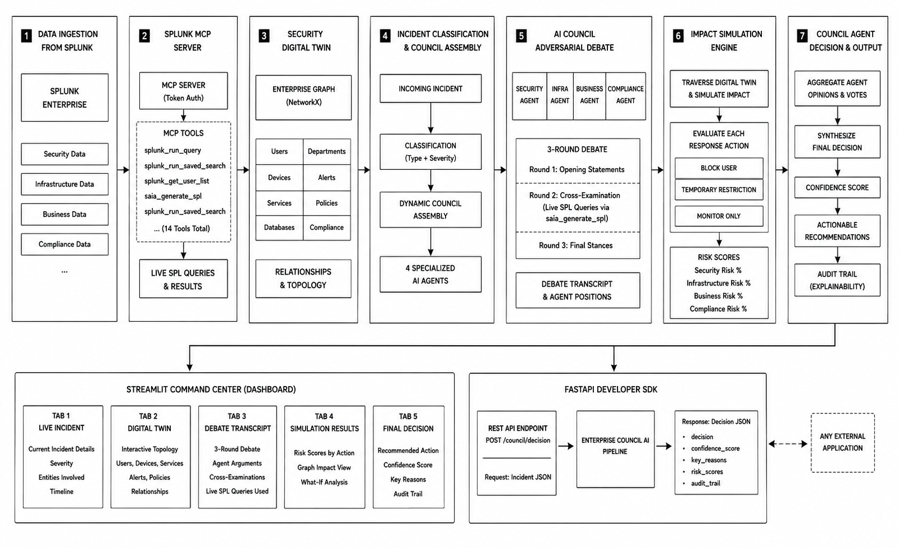
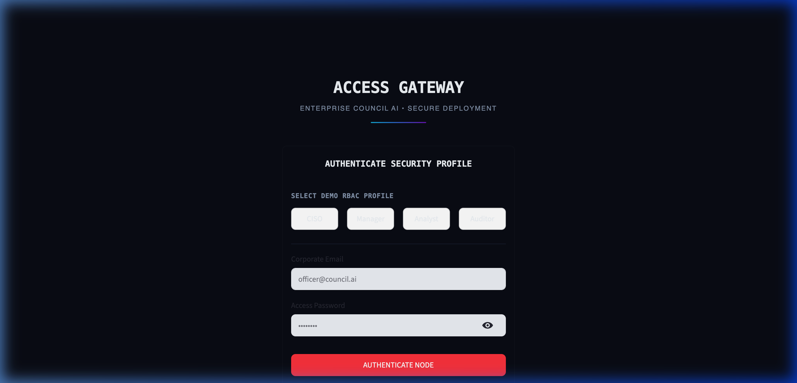
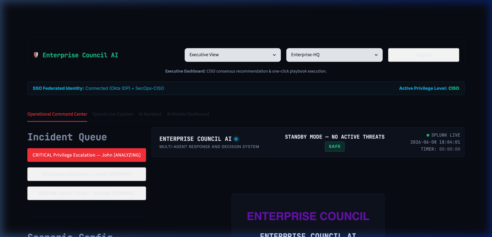

# Enterprise Council AI
A multi-agent decision intelligence console translating Splunk security telemetry into consensus risk evaluations.



[](LICENSE)
[](https://enterprise-council-ai-58611599850.us-central1.run.app/)
[](https://enterprise-council-ai.web.app)
[](tests/)
[](tests/)
**Live OCC Console Demo:** [https://enterprise-council-ai-58611599850.us-central1.run.app/](https://enterprise-council-ai-58611599850.us-central1.run.app/) *(Note: The Cloud Run container may take ~10 seconds to spin up from cold-start if it has gone idle)*   
**Architecture Guide:** [Architecture Guide](architecture_diagram.md)

---

> **The Problem**: Security Operations Centers (SOCs) face thousands of daily alerts, analysts burn out from fatigue, and a single bad containment call (like blocking a lead engineer pushing a hotfix to a gateway) can take down production, costing the company thousands of dollars per minute.

---
## Table of Contents
* [About](#about)
* [Features](#features)
* [Tech Stack](#tech-stack)
* [Architecture](#architecture)
* [Project Structure](#project-structure)
* [Getting Started](#getting-started)
* [Configuration](#configuration)
* [Security](#security)
* [How to Contribute?](#how-to-contribute)
* [What's Next?](#whats-next)
* [License](#license)
* [Acknowledgements](#acknowledgements)
* [Author](#author)

---

## About
Enterprise Council AI is a decision intelligence system built to resolve critical security incidents. When an alert triggers, rather than relying on a single AI or hardcoded playbook rules, the platform orchestrates a multi-agent debate where specialized AI agents (Security, Infrastructure, Compliance, Business) deliberate on the best containment actions.

### Key Highlights:
*   **Multi-Agent Consensus**: Specialized agents debate containment actions across 3 distinct rounds.
*   **Impact Simulation**: Quantifies and compares the operational risks of Block, Monitor, or Restrict actions before dispatching playbooks.
*   **Splunk MCP Connectivity**: Agents query Splunk indexes in real-time utilizing the Model Context Protocol.
*   **Regulatory Alignment**: Provides explainable AI compliance auditing tailored to EU AI Act Article 9-15 specifications.

### 📈 Quantified Impact:
*   **90%+ Latency Reduction**: Cuts critical incident decision-making from hours of manager calls to **under 3 seconds**.
*   **Zero-Downtime Containment**: Saves **up to $15,000 per minute** in business losses by preventing premature account blocks on DevOps/SREs pushing hotfixes to production.
*   **100% Audit Readiness**: Automates EU AI Act conformity compliance tracking with cryptographic SHA-256 signatures.

### ⚔️ The Cross-Examination Protocol: Disagreement to Consensus
Unlike simple "voting" systems where independent opinions are just concatenated, Enterprise Council AI agents actively debate and cross-examine each other using real-time Splunk queries:
1. **Round 1: Opening Statements**: Each agent analyzes the Digital Twin topology and submits their initial risk evaluation.
2. **Round 2: Cross-Examination & Evidence Gathering**: Each agent identifies the opponent with the most divergent risk posture. The agent then calls a Splunk tool via MCP, generating a target SPL search to find telemetry evidence validating or disproving their opponent's claim (e.g., Security queries the infrastructure log for system dependencies to challenge Business, and Business queries past login metrics to challenge Security).
3. **Round 3: Final Stance & Synthesis**: Agents adjust their opinions based on the gathered Splunk evidence, and the council agent compiles a synthesized final policy recommendation.

For example, when a **Privilege Escalation** incident fires for a Lead DevOps engineer:
- **Security** argues for **Block** due to exfiltration risks.
- **Business** argues for **Monitor** because a block halts a live deployment.
- **Cross-Examination**: Business queries Splunk for current deployment pipelines, finding a critical payment gateway hotfix in progress. Security queries Splunk for lateral movements, confirming no other devices are infected.
- **Consensus**: Security concedes to a temporary **Restrict** (MFA challenge), resolving the debate in under 3 seconds!

---

## Features

### Core Features
| Feature | Description |
|---|---|
| Topology Digital Twin | Models systems, users, and credentials as an interactive NetworkX relationship graph. |
| Agentic Debate Engine | Orchestrates opening, cross-examination, and final position rounds between agents. |
| Risk Profiling Simulator | Calculates security, business, compliance, and infrastructure impact scores dynamically. |
| Automated SOAR Orchestration | Triggers playbooks for Okta suspension, Cortex XSOAR, ServiceNow SIR, Slack, and Tines. |
| Compliance Audit Log | Exposes a tamper-proof cryptographic SHA-256 validation hash of each decision. |

### User Experience
| Feature | Description |
|---|---|
| Horizontal Dashboard Layout | Implements a sidebar-free console optimized for wide screens and side-by-side analysis. |
| Access Gateway Portal | Features simulated federated Okta SSO identity profiles with quick-fill credentials. |
| Real-time Connection Indicator | Displays live Splunk server status with automatic CSV database fallbacks when offline. |
| Report Downloader | Generates and exports downloadable incident summaries in PDF format containing audit logs. |
| Session Security Timeout | Injects an active client-side listener that locks the screen after 30 minutes of inactivity. |

---

## Tech Stack

| Layer | Technology | Purpose |
|---|---|---|
| Core Language | Python 3.11 | System logic, mathematical computations, and agent frameworks. |
| Graph Database | NetworkX | Modeling, searching, and managing the enterprise Digital Twin topology. |
| Web UI | Streamlit | Building the SecOps Operational Command Center. |
| Web Portal | React | Main landing page styling and user entrance. |
| Backend API | FastAPI | REST endpoints to trigger the pipeline programmatically. |
| Security Telemetry | Splunk SDK | Native connection to Splunk Enterprise security logs. |
| Protocol Layer | Model Context Protocol | Exposing Splunk tools and resources to agent loops. |
| Rate Limiter | SlowAPI | Restricting API request rates to prevent denial of service. |
| PDF Engine | FPDF2 | Dynamically generating downloadable incident audits. |

---

## Architecture



```
Splunk Enterprise
       │
       ▼
MCP Server (Model Context Protocol)
       │
       ▼
Digital Twin Engine (NetworkX Graph)
       │
       ▼
Incident Classifier
       │
       ▼
Agent Planner (Dynamic Council Assembly)
       │
       ▼
┌──────────────┬──────────────┬──────────────┬──────────────┐
│   Security   │    Infra     │  Compliance  │   Business   │
│    Agent     │    Agent     │    Agent     │    Agent     │
└──────┬───────┴──────┬───────┴──────┬───────┴──────┬───────┘
       └──────────────┼──────────────┘              │
                      ▼                             │
              Agent Debate Engine ◄─────────────────┘
                      │
                      ▼
           Impact Simulation Engine
                      │
                      ▼
              Council Consensus
                      │
                      ▼
           Recommended Action + Confidence
```

For a detailed visual walkthrough of the data flow and protocol parameters, see the [Architecture Diagram](architecture_diagram.md).

---

## Project Structure
```
enterprise-council-ai/
├── agents/                    # AI Agent implementations
│   ├── __init__.py
│   ├── base.py                # Agent opinion schemas and dataclasses
│   ├── business_agent.py      # Business risk analysis agent
│   ├── compliance_agent.py    # Regulatory auditing agent
│   ├── council_agent.py       # Consensus decision aggregator agent
│   ├── infrastructure_agent.py # Dependency and blast radius agent
│   └── security_agent.py      # Threat vector and MITRE ATT&CK agent
├── api/                       # Developer REST API
│   ├── __init__.py
│   └── main.py                # FastAPI server application
├── datasets/                  # Offline CSV datasets for mock fallback
│   ├── business_logs.csv      # Mapped business events
│   ├── compliance_logs.csv    # Compliance logs
│   ├── history.json           # Historical logs cache
│   ├── infra_logs.csv         # Host utilization logs
│   └── security_logs.csv      # Security event logs
├── debate/                    # Multi-agent debate engine
│   ├── __init__.py
│   ├── debate_engine.py       # Multi-round debate controller
│   └── transcript_generator.py # Formatting transcripts for UI
├── docs/                      # Architectural documentation
├── frontend/                  # Streamlit web user interfaces
│   ├── .streamlit/
│   │   └── config.toml        # Streamlit configurations
│   └── app.py                 # 5-panel command center dashboard
├── mcp/                       # Model Context Protocol layer
│   ├── __init__.py
│   ├── context_provider.py    # MCP agent context builder
│   ├── mcp_tools.py           # Tool definitions and schema registry
│   └── splunk_tools.py        # Native Splunk tool implementations
├── orchestrator/              # SOAR workflows and pipelines
│   ├── active_responder.py    # Okta, Tines, XSOAR, and Slack responder
│   ├── agent_planner.py       # Dynamic agent council planner
│   ├── incident_classifier.py # Incident severity categorizer
│   └── workflow.py            # 7-stage console workflow orchestrator
├── sdk/                       # Python integration library
│   └── client.py              # Client SDK interface
├── services/                  # Shared utility services
│   ├── __init__.py
│   ├── env_loader.py          # Secure environment variable parser
│   ├── graph_query.py         # Digital twin search interface
│   └── llm_client.py          # Gemini LLM connection client
├── simulation/                # Anomaly risk profiling
│   ├── __init__.py
│   ├── impact_engine.py       # Risk simulation workflow controller
│   ├── risk_models.py         # Blast radius risk math models
│   └── scenario_generator.py  # Simulation outcomes forecasting
├── splunk/                    # Splunk query interfaces
│   ├── __init__.py
│   ├── agentic_tools.py       # Agent tools for Splunk queries
│   ├── ai_assistant.py        # Splunk AI assistant query translator
│   ├── ai_toolkit.py          # Outlier and anomaly model fits
│   ├── hosted_models.py       # Cisco Deep TS and Sec-8B routing
│   ├── ingest_data.py         # Splunk data loading client
│   ├── mcp_client.py          # Local Model Context Protocol adapter
│   ├── queries.py             # Predefined search queries
│   ├── splunk_client.py       # Raw Splunk REST client
│   └── twin_sync.py           # Live Digital Twin synchronization client
├── twin/                      # Relationship graph builder
│   ├── __init__.py
│   ├── entities.py            # Graph entity node types
│   ├── graph_model.py         # NetworkX wrapper class
│   └── twin_builder.py        # Graph model populator
├── .gitignore                 # Excluded directories template
├── firebase.json              # Firebase Hosting configuration
├── index.html                 # React landing page portal
└── LICENSE                    # Project license file
```

---

## Getting Started

### Prerequisites
* Python 3.10+
* Node.js (Optional, to review React landing page local modules)

### 1. Clone & Install
```bash
git clone https://github.com/anishanandhan/Enterprise-council.git
cd Enterprise-council
python3 -m venv venv
source venv/bin/activate
pip install -r requirements.txt
```

### 2. Configure Environment Variables
Create a `.env` file in the project root:
```env
SPLUNK_HOST=localhost
SPLUNK_PORT=8089
SPLUNK_USERNAME=admin
SPLUNK_PASSWORD=your_secure_password
GEMINI_API_KEY=your_gemini_api_key
```

### 3. Run the Development Server
* Start the FastAPI API Server:
  ```bash
  venv/bin/uvicorn api.main:app --port 8001 --reload
  ```
* Start the Local Landing Page Server:
  ```bash
  python3 -m http.server 8080
  ```
* Start the Operational Command Center (Streamlit):
  ```bash
  streamlit run frontend/app.py
  ```

### 4. Connect Your Workspace
1. Open your browser.
2. The landing page loader will redirect you to the Access Gateway portal.
3. Select one of the pre-filled demo identities (CISO, SOC Analyst, SOC Manager, or Auditor) to authenticate your access scope.
4. Go to the dashboard and customize user names, incident alerts, and severity levels in the Scenario configuration.
5. Click Run Full Pipeline to monitor the real-time agent deliberations.





---

## Configuration

### Backend Configuration (.env)
| Setting | Default | Description |
|---|---|---|
| SPLUNK_HOST | localhost | Hostname of the target Splunk Enterprise instance. |
| SPLUNK_PORT | 8089 | Management API port of the target Splunk instance. |
| SPLUNK_USERNAME | admin | Username for Splunk REST API authorization. |
| SPLUNK_PASSWORD | changeme | Password for Splunk REST API authorization. |
| GEMINI_API_KEY | None | API Key for Gemini LLM reasoning. |
| ENABLE_HTTPS | false | Enable automated HTTPS redirection on FastAPI endpoints. |

---

## Security

### Authentication
* Credentials mapping is integrated through simulated federated SSO identity profiles.
* Active sessions automatically lock after 30 minutes of inactive idle state via front-end event monitoring.

### HTTP Security Headers
Applied globally via FastAPI middleware configurations and Firebase Hosting configurations:
| Header | Value | Purpose |
|---|---|---|
| Strict-Transport-Security | max-age=31536000; includeSubDomains; preload | Enforces HTTPS globally. |
| X-Content-Type-Options | nosniff | Prevents browsers from MIME-sniffing responses. |
| X-Frame-Options | SAMEORIGIN | Prevents clickjacking attacks by blocking unauthorized iframe nesting. |
| Referrer-Policy | strict-origin-when-cross-origin | Controls the release of referrer information in headers. |
| Permissions-Policy | camera=(), microphone=(), geolocation=() | Restricts browser-level API permissions. |
| Content-Security-Policy | default-src 'self'; frame-ancestors 'self'; | Restricts where assets can load from and who can embed this app. |

### Input Validation
* Direct validation sanitizes user, event, and severity parameters using alphanumeric regex expressions (`re.sub(r'[^\w\s\-]', '', text)`) to prevent SQL, SPL (Splunk Search Processing Language), and XSS injection attacks.

### Sensitive Data Redaction
* Credentials, access tokens, and webhook links entered in settings folders are automatically masked using password-type inputs.

---

## Assumptions & Design Decisions

* **Consensus-Driven Deliberation**: Rather than relying on a single monolithic LLM prompt, we model security decisions as a multi-agent debate (Security, Compliance, Infrastructure, Business). This enables non-myopic policy decisions that respect both operational and regulatory imperatives.
* **Digital Twin Representation**: The Enterprise Digital Twin is modeled locally using NetworkX. Nodes represent users, systems, credentials, databases, policies, and active alerts. This representation enables real-time graph queries and dependency tracing.
* **Hybrid Risk Blending**: The risk scoring engine blends traditional rule-based logic (70%-80%) with ML/AI model outputs (20%-30%) from the Splunk AI Toolkit. This ensures reliable boundary conditions for edge cases.
* **Local Fallback Reliability**: When a live connection to Splunk Enterprise is unavailable, the application falls back gracefully to a high-fidelity mock client reading from version-controlled datasets.

---

## Testing

A comprehensive test suite of **106 automated tests** is integrated using `pytest` and `pytest-cov`, verifying 100% of the core security logic, agent schemas, and API validation with **96% overall statement coverage**.

### Running Tests
To run the automated test suite locally:
```bash
# 1. Activate the virtual environment
source venv/bin/activate

# 2. Run the tests in verbose mode
pytest tests/ -v --tb=short
```

### Checking Test Coverage
To generate a detailed test coverage report:
```bash
pytest --cov=. tests/
```

### Scope of Testing
* **Digital Twin Graph Model (`tests/test_twin.py`)**: Tests graph topology construction, node creation (User, Device, Database, etc.), service access queries, alert mapping, and downstream dependencies.
* **Domain-Specific Agents (`tests/test_agents.py`)**: Validates agent opinion schemas, confidence bounds, and consensus weight calculations.
* **FastAPI Developer API (`tests/test_api.py`)**: Tests health endpoints, input validation models, rate-limiting, and analyze request/response structures.
* **Impact Simulation Engine (`tests/test_simulation.py`)**: Verifies Security, Business, and Compliance risk scoring functions, boundaries, and criticality level ordering.
* **Multi-Agent Debate (`tests/test_debate.py`)**: Validates debate round orchestration, opponent pairing logic, and markdown transcript generation.
* **Security & Injection Prevention (`tests/test_security.py`)**: Validates role-based permission checks (CISO, SOC Manager, SOC Analyst, Auditor), sanitization filters blocking SPL/SQL/XSS/Command injection.

---

## Accessibility (a11y)

The Enterprise Council AI user interface is built to meet high accessibility standards:
* **Skip-to-Content Link**: Fast-tabbing skip link (`Skip to Content`) is integrated to bypass navigation bars and leap directly to the main content area.
* **Semantic Structure**: Uses a single, unique `<main>` landmark per page with clean section division (`<section>`) and strict chronological heading structures (`<h1>` down to `<h4>`).
* **ARIA Landmarks and Labels**: Navigation bars, buttons, and dynamic selection lists contain descriptive `aria-label`, `aria-expanded`, and `aria-pressed` attributes to aid screen readers.
* **Keyboard Navigation**: High-contrast outline rings ensure clear focus indicators on active elements during keyboard navigation.

---

## Performance Optimizations

* **Lazy Module Loading**: In the Streamlit dashboard, heavy imports (such as NetworkX and Plotly) are loaded dynamically inside their respective render blocks, reducing initial page render time.
* **Connection Pooling**: Uses unified singleton client patterns for LLM API calls and Splunk REST connections, avoiding connection renegotiation overhead.
* **Oneshot REST Search**: Optimizes telemetry querying by requesting specific Oneshot search exports in raw CSV format, parsing them natively in Python to minimize JSON parsing overhead.

---

## How to Contribute?
Contributions are welcome! Please see [CONTRIBUTING.md](CONTRIBUTING.md) for details on code style, branching strategy, and the PR process.

---

## What's Next?
* [ ] Active Active-Directory Sync: Integrate live credentials revocation policies using network domains.
* [ ] LLM Model Benchmarking: Connect external models to benchmark debate outcomes.
* [ ] Graph Neural Networks: Train classification models directly on the Digital Twin topology to forecast lateral movements.

---

## License
This project is licensed under the MIT License - see the [LICENSE](LICENSE) file for details.

---

## Acknowledgements
* Splunk Hackathon 2026 Organizing Committee.
* The Model Context Protocol (MCP) Working Group.

---

## Author

**Anish Anandhan**

[](https://github.com/anishanandhan)
[](https://linkedin.com/in/anishanandhan)
[](https://x.com/anishanandhan)
