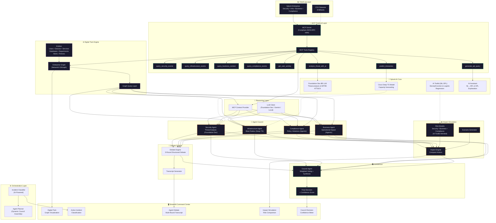
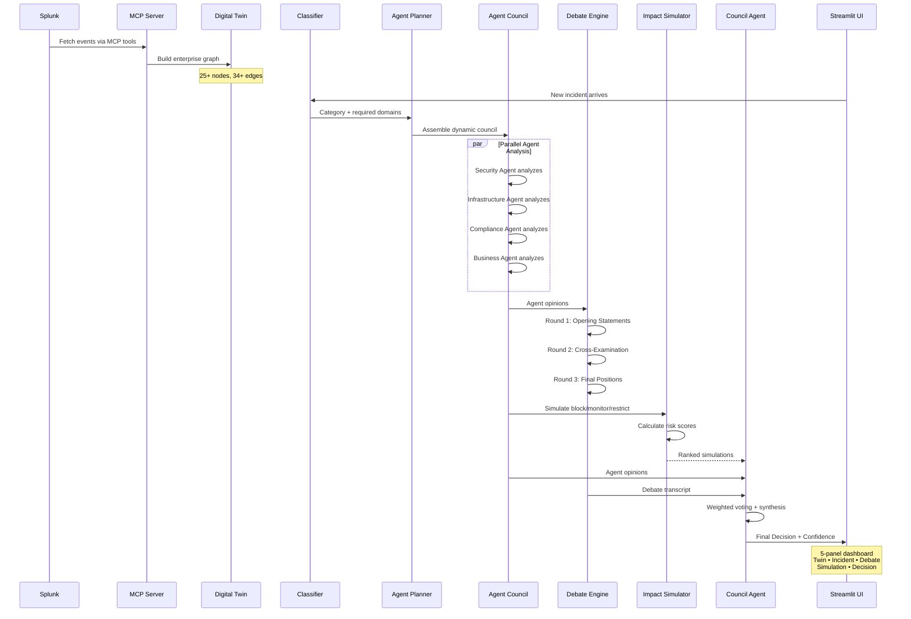
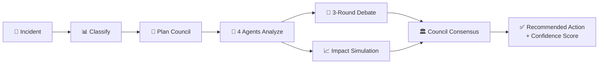

# Architecture Diagram

## Enterprise Council AI — System Architecture

```mermaid
graph TB
    subgraph DATA["📊 Data/Log Layer"]
        SPLUNK["Splunk Enterprise<br/>Security • Infra • Business • Compliance"]
        CSV["CSV Datasets<br/>(Fallback)"]
    end

    subgraph SPLUNK_AI["🧠 Splunk AI Core"]
        FSEC["Foundation-Sec-8B LLM<br/>Threat analysis & MITRE ATT&CK"]
        DTS["Cisco Deep TS Model<br/>Capacity forecasting"]
        MLTK["AI Toolkit (ML-SPL)<br/>DensityFunction & Logistic Regression"]
        AI_ASST["AI Assistant<br/>NL→SPL & SPL Explanation"]
    end

    subgraph MCP_LAYER["📡 MCP Protocol Layer"]
        MCP_SERVER["MCP Server<br/>(Compliant JSON-RPC stdio)"]
        MCP_TOOLS["MCP Tools Registry"]
        TOOL1["query_security_events"]
        TOOL2["query_infrastructure_events"]
        TOOL3["query_business_context"]
        TOOL4["query_compliance_events"]
        TOOL5["get_user_activity"]
        TOOL6["analyze_threat_with_ai"]
        TOOL7["predict_timeseries"]
        TOOL8["generate_spl_query"]
    end

    subgraph TWIN["🌐 Digital Twin Engine"]
        GRAPH["Enterprise Graph<br/>(NetworkX DiGraph)"]
        ENTITIES["Entities<br/>Users • Devices • Services<br/>Databases • Departments<br/>Alerts • Policies"]
        QUERY["Graph Query Layer"]
    end

    subgraph ORCHESTRATOR["⚙️ Orchestration Layer"]
        CLASSIFIER["Incident Classifier<br/>(AI-Powered)"]
        PLANNER["Agent Planner<br/>(Dynamic Council Assembly)"]
    end

    subgraph AGENTS["🤖 Agent Council"]
        SEC["Security Agent<br/>Threat Analysis (Foundation-Sec)"]
        INFRA["Infrastructure Agent<br/>Blast Radius (Deep TS)"]
        COMP["Compliance Agent<br/>Policy Violations (Agentic)"]
        BIZ["Business Agent<br/>Operational Impact (Agentic)"]
    end

    subgraph REASONING["🧠 Reasoning Layer"]
        LLM["LLM Client<br/>(Foundation-Sec / Gemini / Local)"]
        CONTEXT["MCP Context Provider"]
    end

    subgraph DEBATE["💬 Debate System"]
        ENGINE["Debate Engine<br/>3-Round Structured Debate"]
        TRANSCRIPT["Transcript Generator"]
    end

    subgraph SIMULATION["📊 Impact Simulation"]
        RISK["Risk Models<br/>Security • Business • Compliance<br/>(AI Toolkit blended)"]
        SCENARIOS["Scenario Generator"]
        IMPACT["Impact Engine<br/>Compare Actions"]
    end

    subgraph CONSENSUS["🏛️ Consensus"]
        COUNCIL["Council Agent<br/>Weighted Voting + Synthesis"]
        DECISION["Final Decision<br/>+ Confidence Score"]
    end

    subgraph UI["🖥️ Streamlit Command Center"]
        P1["Digital Twin<br/>Graph Visualization"]
        P2["Active Incident<br/>Classification"]
        P3["Agent Debate<br/>Multi-Round Transcript"]
        P4["Impact Simulation<br/>Risk Comparison"]
        P5["Council Decision<br/>Confidence Meter"]
    end

    %% Data Flow
    SPLUNK --> MCP_SERVER
    CSV -.-> MCP_SERVER
    MCP_SERVER --> MCP_TOOLS
    MCP_TOOLS --> TOOL1 & TOOL2 & TOOL3 & TOOL4 & TOOL5 & TOOL6 & TOOL7 & TOOL8

    TOOL6 --> FSEC
    TOOL7 --> DTS
    TOOL8 --> AI_ASST

    MCP_TOOLS --> GRAPH
    ENTITIES --> GRAPH
    GRAPH --> QUERY

    QUERY --> CONTEXT
    MCP_TOOLS --> CONTEXT

    CLASSIFIER --> PLANNER

    CONTEXT --> SEC & INFRA & COMP & BIZ
    LLM --> SEC & INFRA & COMP & BIZ
    QUERY --> SEC & INFRA & COMP & BIZ
    FSEC -.-> SEC
    DTS -.-> INFRA
    MLTK -.-> RISK

    SEC & INFRA & COMP & BIZ --> ENGINE
    ENGINE --> TRANSCRIPT

    SEC & INFRA & COMP & BIZ --> IMPACT
    RISK --> IMPACT
    SCENARIOS --> IMPACT

    SEC & INFRA & COMP & BIZ --> COUNCIL
    IMPACT --> COUNCIL
    ENGINE --> COUNCIL
    COUNCIL --> DECISION

    GRAPH --> P1
    CLASSIFIER --> P2
    TRANSCRIPT --> P3
    IMPACT --> P4
    DECISION --> P5

    %% Styling
    classDef splunk fill:#1a1a2e,stroke:#667eea,color:#e2e8f0
    classDef mcp fill:#1a1a2e,stroke:#10b981,color:#e2e8f0
    classDef twin fill:#1a1a2e,stroke:#764ba2,color:#e2e8f0
    classDef agent fill:#1a1a2e,stroke:#f97316,color:#e2e8f0
    classDef sim fill:#1a1a2e,stroke:#eab308,color:#e2e8f0
    classDef decision fill:#1a1a2e,stroke:#22c55e,color:#e2e8f0

    class SPLUNK,CSV splunk
    class MCP_SERVER,MCP_TOOLS,TOOL1,TOOL2,TOOL3,TOOL4,TOOL5,TOOL6,TOOL7,TOOL8 mcp
    class GRAPH,ENTITIES,QUERY twin
    class SEC,INFRA,COMP,BIZ agent
    class RISK,SCENARIOS,IMPACT sim
    class COUNCIL,DECISION decision
```

---

## Pipeline Flow

```mermaid
sequenceDiagram
    participant S as Splunk
    participant M as MCP Server
    participant T as Digital Twin
    participant C as Classifier
    participant P as Agent Planner
    participant A as Agent Council
    participant D as Debate Engine
    participant I as Impact Simulator
    participant K as Council Agent
    participant U as Streamlit UI

    S->>M: Fetch events via MCP tools
    M->>T: Build enterprise graph
    Note over T: 25+ nodes, 34+ edges

    U->>C: New incident arrives
    C->>P: Category + required domains
    P->>A: Assemble dynamic council

    par Parallel Agent Analysis
        A->>A: Security Agent analyzes
        A->>A: Infrastructure Agent analyzes
        A->>A: Compliance Agent analyzes
        A->>A: Business Agent analyzes
    end

    A->>D: Agent opinions
    D->>D: Round 1: Opening Statements
    D->>D: Round 2: Cross-Examination
    D->>D: Round 3: Final Positions

    A->>I: Simulate block/monitor/restrict
    I->>I: Calculate risk scores
    I-->>K: Ranked simulations

    A->>K: Agent opinions
    D->>K: Debate transcript
    K->>K: Weighted voting + synthesis
    K->>U: Final Decision + Confidence

    Note over U: 5-panel dashboard<br/>Twin • Incident • Debate<br/>Simulation • Decision
```

---

## Decision Flow

```mermaid
flowchart LR
    A["🚨 Incident"] --> B["📊 Classify"]
    B --> C["🔧 Plan Council"]
    C --> D["🤖 4 Agents Analyze"]
    D --> E["💬 3-Round Debate"]
    D --> F["📈 Impact Simulation"]
    E --> G["🏛️ Council Consensus"]
    F --> G
    G --> H["✅ Recommended Action<br/>+ Confidence Score"]
```
